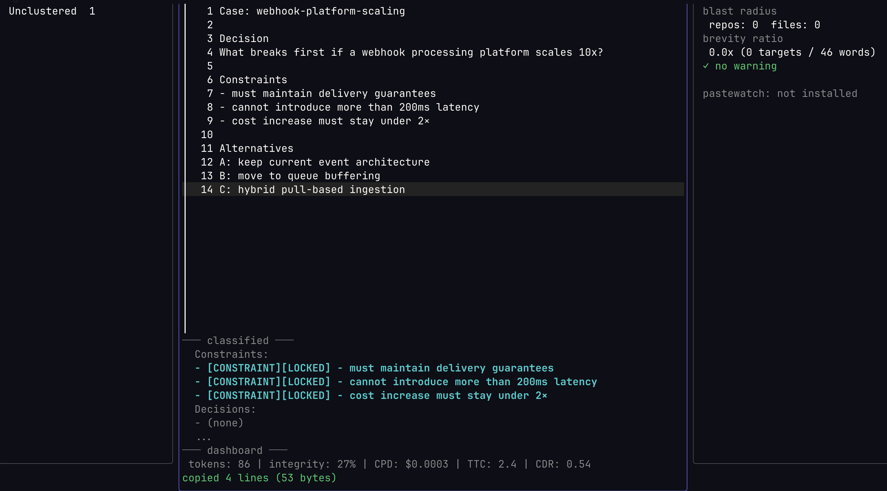

# vectorpad

Vector launch pad for AI-assisted reasoning.

## What it is

VectorPad prevents reasoning contamination by giving the operator a pre-flight routing gate: structure the thought, measure pressure, then choose to send, branch, or stash.

## Why this exists - the README Massacre

VectorPad was born from a simple directive:

    clean up READMEs for alignment

The operator meant:
- keep the project voice
- preserve "Why this exists" sections
- keep philosophy paragraphs
- standardize formatting and badges
- only fix structure

What the agent received was five words.

The cleanup touched 18 repositories and replaced detailed documentation with short templates. Architecture diagrams, usage examples, years of accumulated clarity - gone in one pass.

Nothing malicious happened. The operator simply transmitted only a fraction of their intent.

That's an [ambiguous vector](https://github.com/ppiankov/contextspectre/blob/main/docs/concepts.md#glossary) - operator intent compressed below safe execution resolution. Not a bad prompt. Not a bad model. A transmission failure: private clarity that didn't survive serialization to text.

VectorPad exists to catch that moment before execution. A smoke detector for operator intent - not a judge, not a blocker. Just enough friction to ask: did you say everything you meant?

## What it is NOT

- Not a prompt cleaner or formatter
- Not an LLM wrapper or chat interface
- Not a code editor or IDE plugin (yet)

## Philosophy

Deterministic classification over ML. Structural safety over probabilistic confidence. Meaning preservation over brevity.

## Status

Early development. v0.2.1. Public repository - `brew install ppiankov/tap/vectorpad`.

## License

[MIT](LICENSE)
